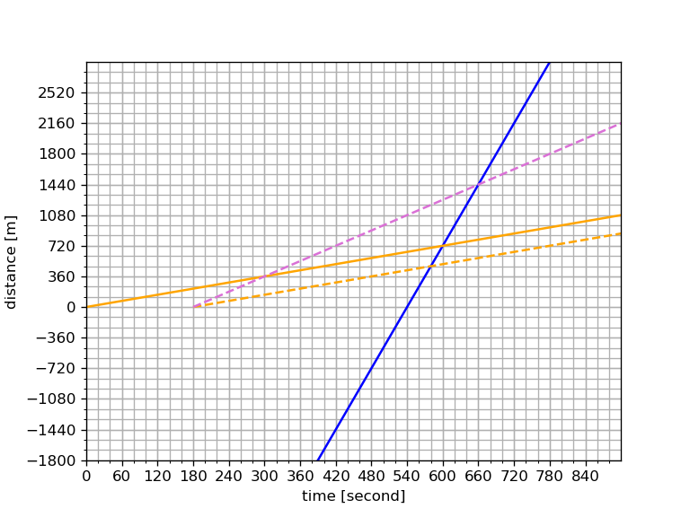
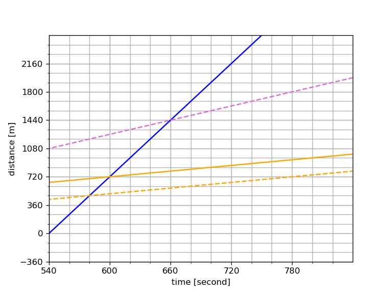
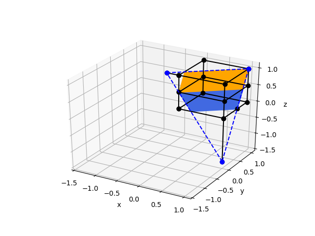
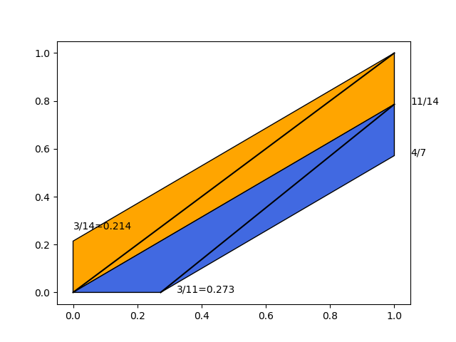

# 麻布中学校 2019年 入試問題 算数

問題は以下の通りです(2019/2現在のリンク先)。解答も下記のサイトと同じ解答が出るようなコードを書きました。

https://www.inter-edu.com/nyushi/azabu/

https://www.yotsuyaotsuka.com/kaitou-sokuhou/

## 問1-1

教室Aの室温が教室Cの室温と同じ、ということは、教室Aの室温が9度以上になればよいです。少なくも7人で2.1度上げて9.1度にする必要があります。教室Cは0.1度単位で室温を上げられるので、教室Cに1人入れば9.1度になります。

教室Bの温度を最も高くするには、教室Aと教室Cの人数を最小にすればよいので、上記の条件を満たせばよいです。よって、教室Aに7人、教室Cに1人、教室Bに33人が答えです。

さてこの問題をコンピュータに解かせてみましょう。教室A,B,Cの室温(temperature)をTa,Tb,Tc、教室A,B,Cの人数(number of students)をSa,Sb,Scとして、以下の制約式を立てます。解を整数にするため、温度を10倍して整数にします。

* Ta = 70 + 3 * Sa
* Tc = 90 + 1 * Sc
* Ta = Tc
* Sa >= 0, Sb >= 0, Sc >= 0
* Sa + Sb + Sc = 41
* Ta, Tb, Tc, Sa, Sb, Sc はすべて整数

この条件で、Tb = 80 + 2 * Sb を最大にする解を探します。 定数80と係数2は最大化にあたって無視できますし、等式を解いて変数Sbを消去することで、以下の制約式が得られます。

* Maximize Tb = -Sa - Sc subject to
* 3 * Sa - 1 * Sc = 20
* Sa >= 0, Sc >= 0
* Sa + Sc <= 41

Rの整数線形計画法ソルバーに解かせてみましょう。

```r
library(lpSolve)
f.object <- c(1, 1)
f.constraint <- matrix(c(3, -1,  1, 0,  0, 1,  1, 1), nrow=4, byrow=TRUE)
f.direction <- c("=", ">=", ">=", "<=")
f.rhs <- c(20, 0, 0, 41)
result <- lp ("min", f.object, f.constraint, f.direction, f.rhs, all.int=TRUE)
print(result$solution)
```

SaとScつまり教室Aと教室Cの人数が得られました。

```text
[1] 7 1
```

## 問1-2

こちらは連立方程式を立てて解けばよいですね。

* Ta = 7 + 0.3 * Sa
* Tb = 8 + 0.2 * Sb
* Tc = 9 + 0.1 * Sc
* Ta = Tb = Tc
* Sa >= 0, Sb >= 0, Sc >= 0
* Sa + Sb + Sc = 41

```r
library(MASS)
a <- matrix(c(0.3, -0.2, 0,  0, 0.2, -0.1,  -0.3, 0, 0.1,  1, 1, 1), nrow=4, byrow=TRUE)
b <- matrix(c(1.0, 1.0, -2.0, 41), nrow=4, 1)
solution <- ginv(a) %*% b
c(7, 8, 9) + c(0.3, 0.2, 0.1) * solution
```

すべての教室が10.6度になりました。

```text
     [,1]
[1,] 10.6
[2,] 10.6
[3,] 10.6
```

## 問2-1

連立方程式を立てて解けばよいですね。まず変数を定義します。

* 太郎君の普段の歩く速さを秒速Vt [m/s]とする
* バスの速さを秒速 b * Vt [m/s]とする。つまりバスの速度は太郎君のb倍である。
* 太郎君の家からA地点までの距離をDa [m] (distance)とする
* 7時50分時点で、バスは太郎君の家から Db [m] 離れた地点にいるとする

問題文を以下のように定式化します。時間の単位は秒です。
* Da = Vt * 600
* Db + Da = b * Vt * 600
* Db + Vt * 400 = b * Vt * 580

今は距離Daには興味が無いので消去します。

* Db + Vt * 600 = b * Vt * 600
* Db + Vt * 400 = b * Vt * 580

続いて距離Dbも消去します。すべての項にVtがあるのでVtで割ると以下が得られます。

* b * Vt * 600 - Vt * 600 = b * Vt * 580 - Vt * 400
* b * 600 - 600 = b * 580 - 400
* b * 20 = 200

b=10、つまり太郎君のバスの速さ:バスの速さ=1:10です。

## 問2-2

7時53分からの経過時間(単位は秒)をtとし、b=10を既知として、問題文を以下のように定式化します。

* Da + 720 = 2.5 * Vt * t
* Db + Da + 720 = 10 * Vt * (t + 180)

tには興味が無いので消去します。

* 4 * Da + 4 * 720 = 10 * Vt * t
* 3 * Da - Db + 3 * 720 = - 10 * Vt * 180

問2-1のDa, Dbの定義を用いて、Vtだけの式にします。
* 3 * (Vt * 600) - (10 * Vt * 580 - Vt * 400) + 3 * 720 = -10 * Vt * 180
* 3 * 720 = 1800 * Vt

よって太郎君の秒速Vtは1.2 (秒/メートル)です。プログラミング言語の出番がありませんでしたので、代わりにグラフを描きます。






```python
#!/usr/bin/python3
# coding: utf-8
from sympy.geometry import Point
import matplotlib.pyplot as plt
from matplotlib import ticker
import numpy as np

duration = 600
delay = 180
speed_ratio = 10.0
speed_per_second = 1.2

origin = Point(0, 0)
distance_usual = duration * speed_per_second
bus = Point(0, distance_usual * (1.0 - speed_ratio))
usual_point = Point(duration, distance_usual)

late = Point(delay, 0)
timestamp_late = duration - 20
distance_late = (timestamp_late - delay) * speed_per_second
point_late = Point(timestamp_late, distance_late)

distance_run = distance_usual + 720
timestamp_run = delay + distance_run / (speed_per_second * 2.5)
point_run = Point(timestamp_run, distance_run)

# 以下を参考
# https://qiita.com/HigashinoSola/items/2ab8894b543e0c55cfa7
def make_ray(point1, point2):
    return zip(point1, point1 + (point2 - point1) * 3)

def plot_line(xmin, xmax, xtick, ymin, ymax, ytick, filename):
    fig = plt.figure()
    ax = fig.add_subplot(1, 1, 1)
    ax.plot(*make_ray(bus, usual_point), color='blue')
    ax.plot(*make_ray(origin, usual_point), linestyle='-', color='orange')
    ax.plot(*make_ray(late, point_late), linestyle='--', color='orange')
    ax.plot(*make_ray(late, point_run), linestyle='--', color='orchid')

    x_minors = np.arange(xmin, xmax, xtick / 3.0)
    ax.set_xticks(np.arange(xmin, xmax, xtick))
    ax.xaxis.set_minor_locator(ticker.FixedLocator(x_minors))
    ax.set_xlim(xmin, xmax)

    y_minors = np.arange(ymin, ymax, ytick / 3.0)
    ax.yaxis.set_minor_locator(ticker.FixedLocator(y_minors))
    ax.set_yticks(np.arange(ymin, ymax, ytick))
    ax.set_ylim(ymin, ymax)

    ax.set_xlabel('time [second]')
    ax.set_ylabel('distance [m]')
    ax.grid(which='both')
    plt.savefig(filename, dpi=120)

plot_line(0, 900, 60, -1800, 2880, 360, '2019math_wide.png')
plot_line(540, 840, 60, -360, 2520, 360, '2019math_narrow.png')
```

## 問3

Think out of the box!



このように切り口を定める三点を結ぶ直線を延長して、直線(X,Y,Z)=(1,0,any), (any,0,1)との交点を求めると、それぞれの餅の上限面との交点が求まります。

問題は切り口の面積そのものではなく、面積の比が分かればよいので、切り口をXY平面に射影すると、それぞれの餅の切り口の面積の比が分かります。三角形の面積を計算すると22:19になります。



モンテカルロシミュレーションを行うと、面積比がだいたい22/19=1.6倍になります。

```r
library(dplyr)
a <- c(1, 1, 0.5)
b <- c(1, 4/7, -0.5)
v <- c(a[2]*b[3]-a[3]*b[2], a[3]*b[1]-a[1]*b[3], a[1]*b[2]-a[2]*b[1])
f <- function(x,y) {
    z <- 0.5 - (v[1] * x + v[2] * y) / v[3]
}

n <- 40000000
df <- tibble(x=runif(n,0,1), y=runif(n,0,1))
df <- dplyr::mutate(df, z=f(x,y))
df_upper <- df %>% dplyr::filter(z > 0.5) %>% dplyr::filter (z < 1)
df_lower <- df %>% dplyr::filter(z < 0.5) %>% dplyr::filter (z > 0)
NROW(df_upper)/NROW(df_lower)
```

## 問4

無限列を遅延評価するプログラミング言語の出番ですね。ここではHaskellにしましたが、皆さんの好きなプログラミング言語の出番ですよ。

```haskell
import Data.List
s = filter (\x -> (x `mod` 3 == 0) || (x `mod` 7 == 0)) $ [1..]
sum $ take 9 $ s
sum $ take 9 $ drop 76 $ s
sum $ take 99 $ s
n=99
get_next (l, i, f) = ((drop 1 l) ++ [head f], i + 1, tail f)
initial_value = (replicate n 0, 0, filter (\x -> x `mod` 3 == 0 || x `mod` 7 == 0) $ [1..])
solution = last $ takeWhile (\(x, i, y) -> sum(x) <= 128205) $ iterate get_next initial_value
(a, b, c) = solution
b-n+1
```

```text
105
1701
11550
506
```

3と7の最小公倍数は21なので、任意の3または7の倍数は21 + i (i=0,3,6,7,9,12,14,15,18)と表現できます。つまりn番目 (先頭を0番目と数える)の数は、floor (n/9) * 21 + [0,3,6,7,9,12,14,15,18]の n mod 9番目、になります。問題文では先頭を1番目と定義してますので(まあ普通はそうですよね)、コードを書くときはその点に注意します。

## 問4-3

問4-1より sum (3,6,7,9,12,14,15,18,21) = 105。1..99番目の数を11組に分けて考えると、105 * 11 + sum(21 * 0 + 21 * 1 + ... + 21 * 10) * 9 = 11550が答。

## 問4-4

以下では、3または7で割り切れる数の集合を昇順に並べたものを候補と呼び、そこから連続する99個の整数を取り出したものを99連続する数と表記します。

99連続する数の先頭の数字が21で割り切れると仮定して、21 * nと置きます。これは問4-3で考えた99連続する数すべてに21 * nを足すことなので、和は11550 + 2079 * nです。11550 + 2079 * n = 128205を満たすnは56.1なので、n=56とおくと和は127974で、128205に231足りません。

そこでこの99連続する数から最小の数字を外し、最大の数の次に大きい候補を加えると、それらの和は21 * 11 = 231増えて128205になります。このとき最小の数字は21 * 56 + 6であり、従って9 * 56 + 2 = 506番目の数、という答えが得られます(先頭を1番目と数えているので)。

## 問5

再び無限列を遅延評価するプログラミング言語の出番ですね。以下の要素からなるタプルを作って、操作を繰り返します。

* 時計回りで最初の針の位置 : 真上が0で時計周りに1,2,と増える
* 最初の針の位置を先頭とする、時計回りに数えた、コインの数字の列
* 操作回数

```haskell
import Data.List
act (d, x:y:ls, i) = ((d+2) `mod` (length(ls) + 2), ls ++ [y,x], i+1)
iterate_act = drop 1 $ iterate act (0, [1..7], 0)
(d, x, i) = last $ take 7 $ iterate_act
(d, x)
(d, x, i) = head $ snd $ span (\(d, x, i) -> x!!0 /= 1 || d/=0) $ iterate_act
i
(d, x, i) = head $ snd $ span (\(d, x, i) -> x /= [1..7] || d/=0) $ iterate_act
i
(d, x, i) = head $ snd $ span (\(d, x, i) -> x /= [1..99] || d/=0) $ drop 1 $ iterate act (0, [1..99], 0)
i
```

```text
(0,[7,4,1,6,3,2,5])
28
84
242550
```

コインが移動する様子を見てみましょう。以下は盤面を上に固定して、針が移動するごとに、真上から時計回りにコインの番号を列挙したものです、

```haskell
display (d, ls, i) = take (length(ls) + 0) $ drop (length(ls) - d) (ls ++ ls)
take 85 $ map display $ iterate act (0, [1..7], 0)
```

```text
[[1,2,3,4,5,6,7],[2,1,3,4,5,6,7],[2,1,4,3,5,6,7],[2,1,4,3,6,5,7],[7,1,4,3,6,5,2],[7,4,1,3,6,5,2],[7,4,1,6,3,5,2],
 [7,4,1,6,3,2,5],[4,7,1,6,3,2,5],[4,7,6,1,3,2,5],[4,7,6,1,2,3,5],[5,7,6,1,2,3,4],[5,6,7,1,2,3,4],[5,6,7,2,1,3,4],
 [5,6,7,2,1,4,3],[6,5,7,2,1,4,3],[6,5,2,7,1,4,3],[6,5,2,7,4,1,3],[3,5,2,7,4,1,6],[3,2,5,7,4,1,6],[3,2,5,4,7,1,6],
 [3,2,5,4,7,6,1],[2,3,5,4,7,6,1],[2,3,4,5,7,6,1],[2,3,4,5,6,7,1],[1,3,4,5,6,7,2],[1,4,3,5,6,7,2],[1,4,3,6,5,7,2],
 [1,4,3,6,5,2,7],[4,1,3,6,5,2,7],[4,1,6,3,5,2,7],[4,1,6,3,2,5,7],[7,1,6,3,2,5,4],[7,6,1,3,2,5,4],[7,6,1,2,3,5,4],
 [7,6,1,2,3,4,5],[6,7,1,2,3,4,5],[6,7,2,1,3,4,5],[6,7,2,1,4,3,5],[5,7,2,1,4,3,6],[5,2,7,1,4,3,6],[5,2,7,4,1,3,6],
 [5,2,7,4,1,6,3],[2,5,7,4,1,6,3],[2,5,4,7,1,6,3],[2,5,4,7,6,1,3],[3,5,4,7,6,1,2],[3,4,5,7,6,1,2],[3,4,5,6,7,1,2],
 [3,4,5,6,7,2,1],[4,3,5,6,7,2,1],[4,3,6,5,7,2,1],[4,3,6,5,2,7,1],[1,3,6,5,2,7,4],[1,6,3,5,2,7,4],[1,6,3,2,5,7,4],
 [1,6,3,2,5,4,7],[6,1,3,2,5,4,7],[6,1,2,3,5,4,7],[6,1,2,3,4,5,7],[7,1,2,3,4,5,6],[7,2,1,3,4,5,6],[7,2,1,4,3,5,6],
 [7,2,1,4,3,6,5],[2,7,1,4,3,6,5],[2,7,4,1,3,6,5],[2,7,4,1,6,3,5],[5,7,4,1,6,3,2],[5,4,7,1,6,3,2],[5,4,7,6,1,3,2],
 [5,4,7,6,1,2,3],[4,5,7,6,1,2,3],[4,5,6,7,1,2,3],[4,5,6,7,2,1,3],[3,5,6,7,2,1,4],[3,6,5,7,2,1,4],[3,6,5,2,7,1,4],
 [3,6,5,2,7,4,1],[6,3,5,2,7,4,1],[6,3,2,5,7,4,1],[6,3,2,5,4,7,1],[1,3,2,5,4,7,6],[1,2,3,5,4,7,6],[1,2,3,4,5,7,6],
 [1,2,3,4,5,6,7]]
```

コードの出力結果を眺めると、針が2周するごとに、コイン1,3,5,7は時計回りに2,2,2,1個分移動するのが分かります(1個分移動するタイミングはコイン1,3,5,7で異なります)。一方コイン2,4,6は針が2周するごとに、反時計回りに2個分ずつ移動するのが分かります。

### 問5-2

針が21回移動すると、針は元の位置に戻り、当初のコイン7の位置にコイン1があります、ここから針が4回移動するとコイン1が元の位置に戻り (この移動はコイン1個分です)、あと3回移動すると針が元の位置に戻ります。よって答えは28回です。

### 問5-3

コイン1,3,5,7の周期は針が28回移動すること、コイン2,4,6の周期は針が21回移動することなので、その最小公倍数をとって、針とすべてのコインが元に戻る周期は、針が84回移動することです。

### 問5-4

上記を一般化すると、コインが2n+1枚あるとき、針とすべてのコインが元に戻る周期は、(2n+1) * (n+1とnの最小公倍数) なので、n=49のときコインは99枚で、周期は242550回になります。n+1とnの最小公倍数というのは、n+1とnは互いに素なので心配要りません。

