# 麻布中学校 2020年 入試問題 算数

問題は以下の通りです(2020/2現在のリンク先)。解答も下記のサイトと同じ解答が出るようなコードを書きました。

https://www.inter-edu.com/nyushi/azabu/

## 問1

まずは肩慣らしですね。Rubyなら一行で書けます。

```ruby
x = (Rational(31, 1) * Rational(23, 6) - Rational(21, 1) * Rational(17, 4)) / (Rational(31, 1) - Rational(21, 1))
=> (71/24)
```

## 問2

差を求めるには、共通して打ち消し合う部分の面積を求める必要はない、ということに気がつくかどうかですね。多くのプログラミング言語で円周率はpiやPIと定義されますが、ここでは題意に従って円周率を3.14とします。

### 問2-1

1/4円から1/2正方形を引けばよいです。PCだと誤差がでますので、丸めてよいでしょう。

```ruby
5 * 5 * (3.14/4.0 - 1.0/2.0)
=> 7.125000000000001
```

### 問2-2

半円を点対称にして張り合わせると分かります。[Python + Matplotlib で書く](2020math.py) とこうなります。

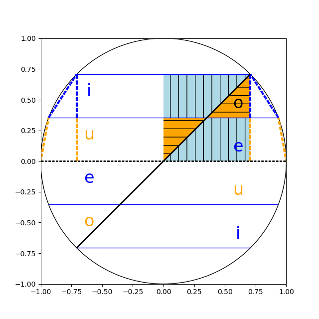

青いハッチから橙のハッチの面積を引くと、対角線が5cmの正方形の面積の、半分の半分になります。それ以外の図形の面積は打ち消しあうので、面積を求めなくてかまいません。よって 5 * 5 / 4.0 = 6.25 cm^2が答えです。

## 問3-1

先頭から順に、

- 任意の6通りの数
- 最初に選ばなかった数で、最初の数が奇数なら偶数、そうでなければ奇数 : 3通り
- 最初に選ばなかった奇数または偶数 : 2通り
- 二番目に選ばなかった偶数または奇数 : 2通り
- 残りの奇数または偶数

なので6 * 3 * 2 * 2 の72通りです。Rで確認しましょう。

```r
library(combinat)
ns <- 1:6
ys <- rep(0, NROW(ns) - 1)
zs <- na.omit(t(sapply(combinat::permn(ns), function(xs) {
    if (all(abs(diff(xs %% 2)) != ys)) {
        matrix(xs, nrow=1)
    } else {
        matrix(NA, nrow=1, ncol=NROW(ns))
    }
})))
NROW(zs)
```

```text
[1] 72
```

### 問3-2

先頭を1とすると 1-2-3-4-5-6, 1-6-5-4-3-2 の二通りになります。先頭が6通りあるので対称性から、2 * 6 = 12通りです。Rで確認しましょう。

```r
library(combinat)
zs <- na.omit(t(sapply(combinat::permn(ns), function(xs) {
    if (all(abs(diff(xs %% 2)) != ys) && all(abs(diff(xs %% 3)) != ys)) {
        matrix(xs, nrow=1)
    } else {
        matrix(NA, nrow=1, ncol=NROW(ns))
    }
})))
NROW(zs)
```

```text
[1] 12
```

## 問4

連立一次方程式を立てて解けばよいです。容器にAに実際に入っていた濃さと、ラベルに書いてあった濃さがごっちゃにならないようにします。食塩水Aの濃さをa%、Bの濃さをb%として、以下の式を解きます。

- 300 * 7 = 120 * a + 180 * b
- (300 + 200) * 7 = 320 * (a - 3) + 180 * b
- 500 * 7 + 320 * 3 = 320 * a + 180 * b : 上記を変形

```r
s <- solve(matrix(c(320, 120, 180, 180), 2, 2), matrix(c(500 * 7 + 320 * 3, 300 * 7)))
s <- s - matrix(c(3.0, 0), ncol = 1, nrow = 2)
s[1,1]
s[2,1]
(matrix(c(120, 180), ncol = 2, nrow = 1) %*% s / (120 + 180))[1,1]
```

順に食塩水Aの濃さ、Bの濃さ、Xの濃さが求まります。

```text
[1] 8.8
[1] 3.8
[1] 5.8
```

元々できるはずだった食塩水が7%だということも検算しましょう。

```r
(matrix(c(320, 180), ncol = 2, nrow = 1) %*% s / (320 + 180))[1,1]
```

```text
[1] 7
```

## 問5

丹念に数えましょう。図形の対称性から、全体の1/6 (60度)分を数えて6倍すればよいです。

## 問6

一番難しい問題です。作図も大変ですよ。

## 問6-1

AとBは最初に、地点Pから、3/(3+5) = 3/8 m 離れたところで出会います。二回目つまり次は、一回目に出会ったところからさらに 3/8 m 離れたところで出会います。つまりn回目は地点Pから n * 3/8 m離れたところ出会います。

出会う場所が地点Pになるのはn * 3/8 が整数のとき、つまりnが8の倍数の時です(3と8が互いに素なので)。n > 0で最初にnが8の倍数になるのはn=8のときで、このときAとBが地点Pで止まり、それまでにn-1=7回すれ違います。

AとB座標を図に起こすとこうなります。上段の横軸は時間、縦軸は円周上の位置です。確かに7回すれ違います。下段の横軸は時間、青い線はsin(角度)、黄色い線はcos(角度)、薄い線はA、濃い線はBの座標です。AとBのsinとcosが両方一致したときにすれ違うので、やはり7回すれ違います。

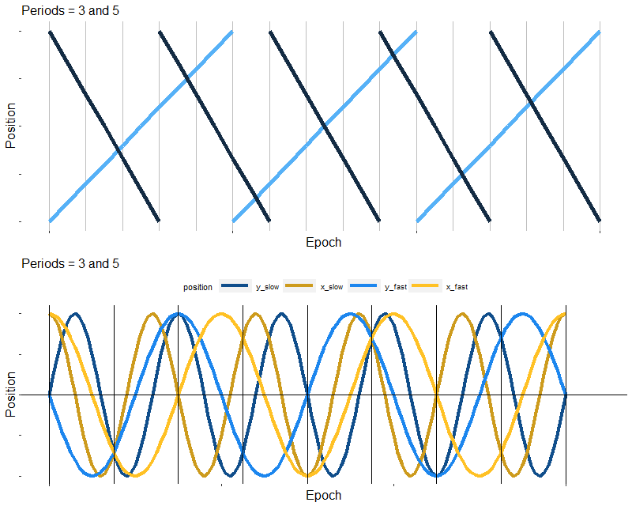

## 問6-2

AとBの速度をそれぞれa, bとします(a < b)。問6-1を一般化すると、aとbが互いに素なら、AとBはn回目は地点Pから n * a/(a+b) m離れたところ出会います。a+bが15で、aとbが互いに疎な数をRで列挙しましょう(なおユークリッドの互除法を考えると、aとbが互いに素ならa+bとa, a+bとbも互いに素です)。

```r
find_combination <- function(n) {
    lapply(1:(n %/% 2), function(x_slow) {
        x_fast <- n - x_slow
        if (gmp::gcd(x_slow, x_fast) == 1) {
            tibble(x_slow=x_slow, x_fast=x_fast)
        } else {
            NULL
        }
    }) %>% dplyr::bind_rows()
}
find_combination(14 + 1)
```

```text
# A tibble: 4 x 2
  x_slow x_fast
   <int>  <dbl>
1      1     14
2      2     13
3      4     11
4      7      8
```

[2020math.R](2020math.R) でサインカーブの交点を数えても、上記と同じ結果になります。

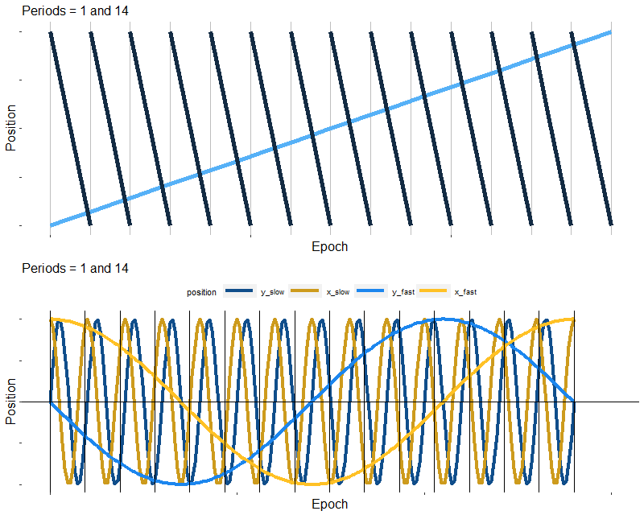
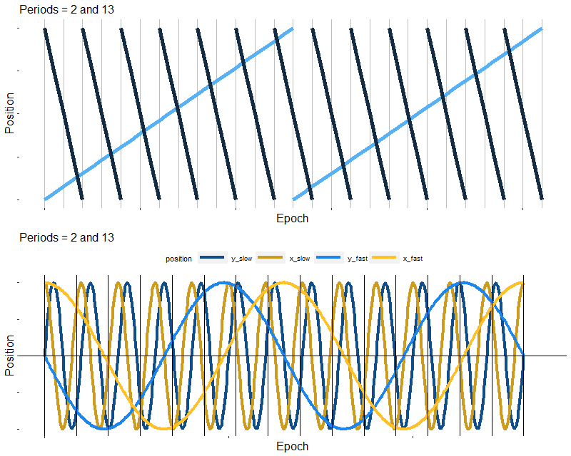
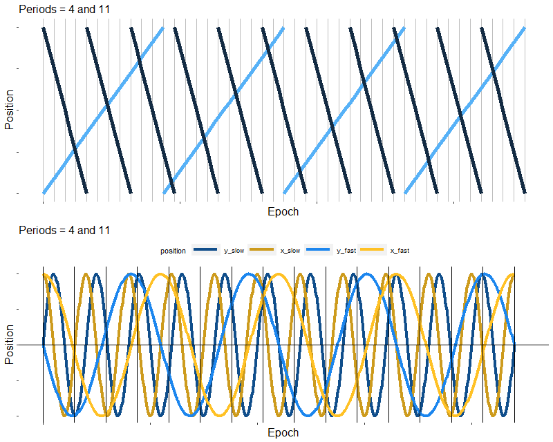
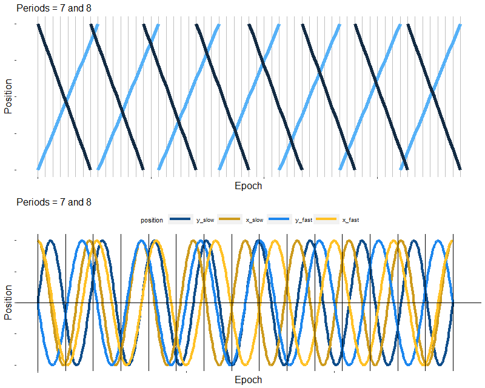

## 問6-3

AとBが地点Pに戻る周期を考えると、Aが単円3周分(3m)、Bが単円を8周分(8m)進んだときに、AとBは初めて地点Pで出会います。このとき合計11m進みます。

一周が2mなので、AとBは最初に地点Pから、2 * 3/(3+8) = 6/11 m 離れたところで出会います。次はAとBが合計2m進み、一回目に出会ったところからさらに 6/11 m 離れたところで出会います。つまりn回目は地点Pから n * 6/11 m離れたところ出会います。ただしこれには例外があって、AとBが合計1m進んで前回出会ったところから 3/11 m 離れたところで出会い、そこが地点Pということがあります。

AとBが地点Pで出会うまでに11 = 2 * 5 + 1 m進むので、5回すれ違ってから合計1m進んで地点Pで出会うことが分かります。

下記の図で、座標は二つの円をほどいて一つの円にしたものです。Aは地点P=0 (Y軸の中間)を出発し、右の円を一周して地点Pに戻ったときをY軸の上限 (+1)、続いてY軸の下限 (-1)から左の円を一周して地点P=0 (Y軸の中間)に戻ります。Bはこれと逆向きに進みます。

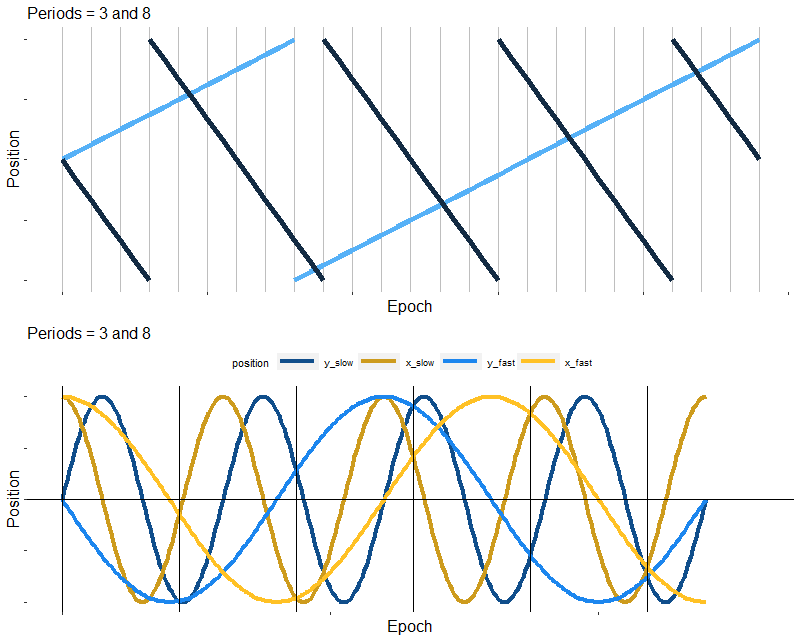

## 問6-4

6回すれ違った後に、AとBが合計1m進んで地点Pで出会う場合と、2m進んで地点Pで出会う場合の両方を数えればよいです。

```r
bind_rows(find_combination(13), find_combination(14)) %>%
    dplyr::arrange(x_slow)
```

```text
# A tibble: 9 x 2
  x_slow x_fast
   <int>  <dbl>
1      1     12
2      1     13
3      2     11
4      3     10
5      3     11
6      4      9
7      5      8
8      5      9
9      6      7
```

[2020math.R](2020math.R) でサインカーブの交点を数えても、上記と同じ結果になります。

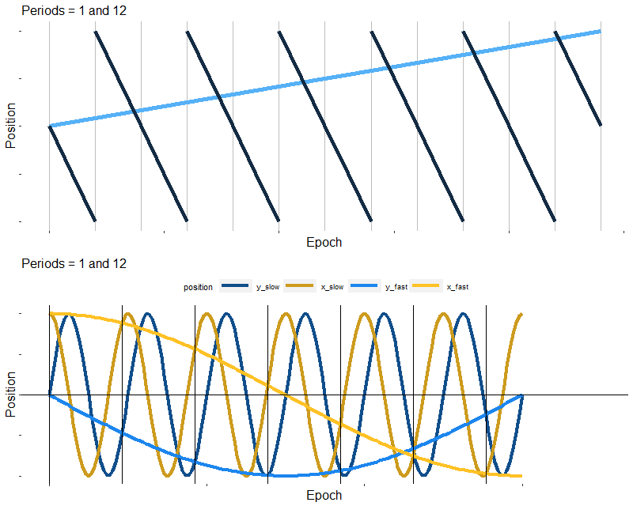
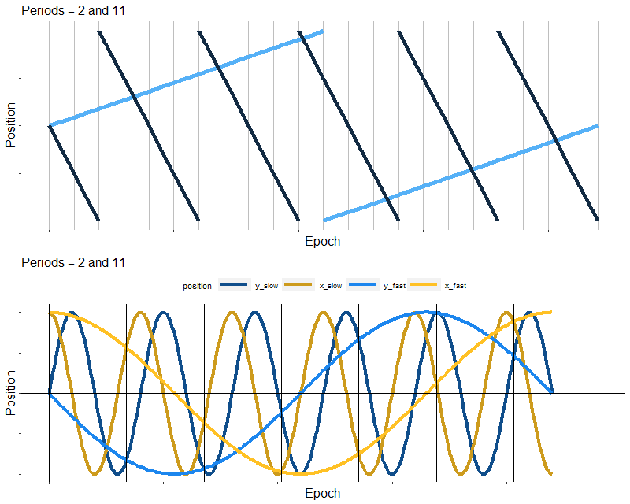
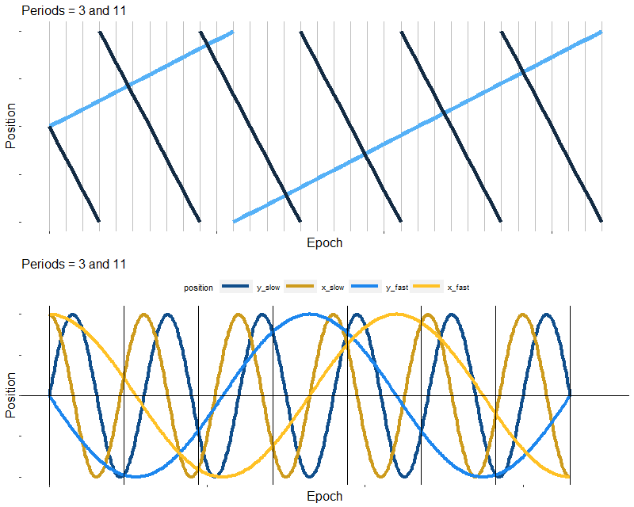
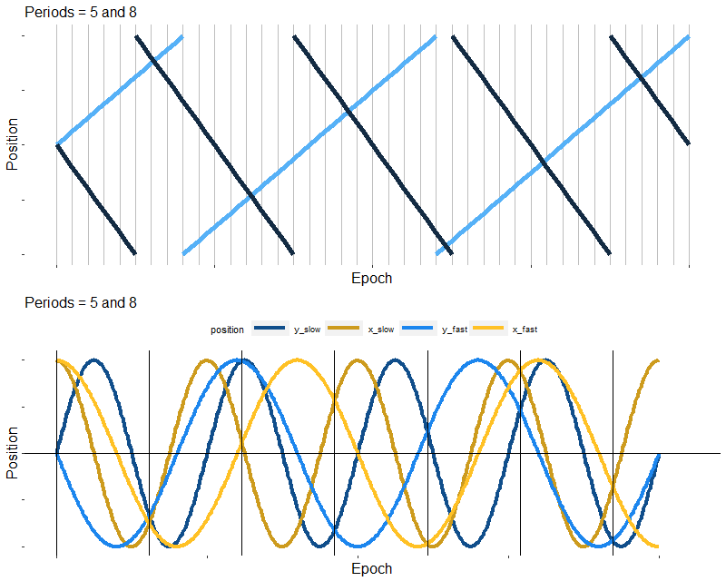
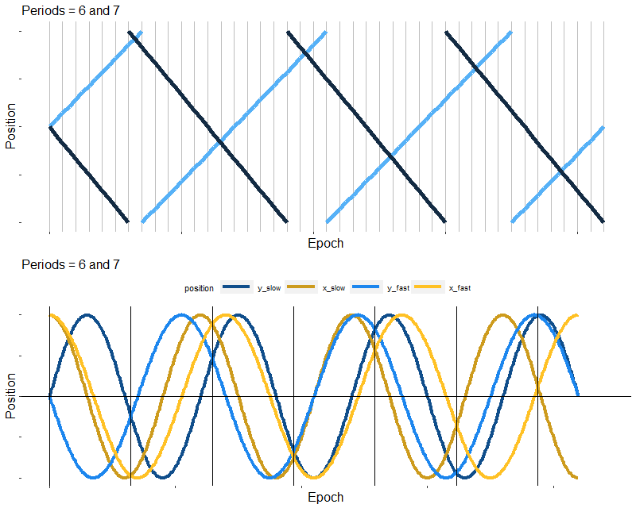
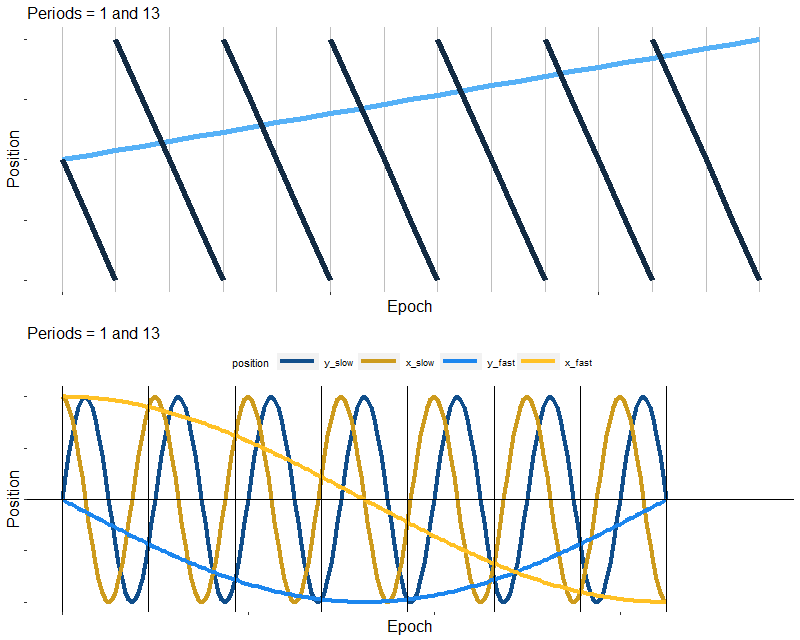
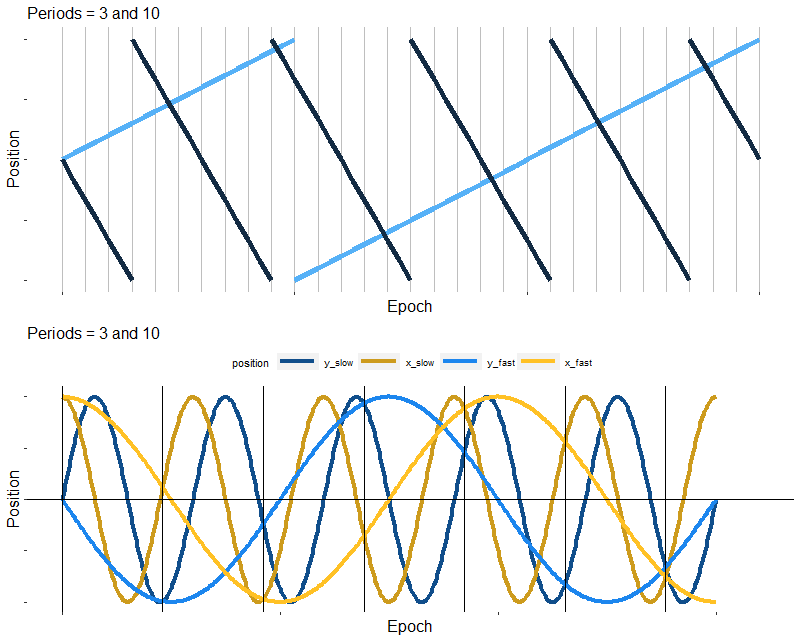
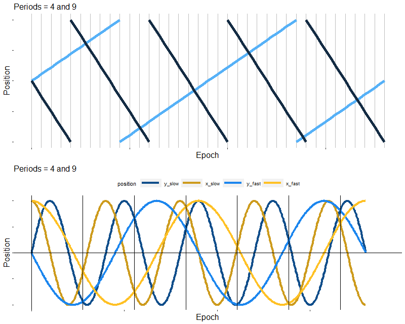
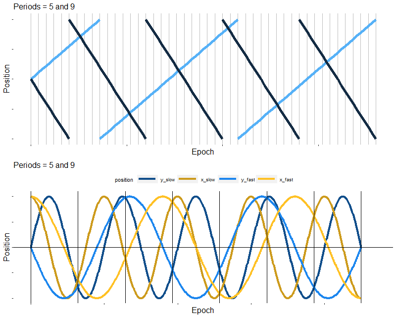
